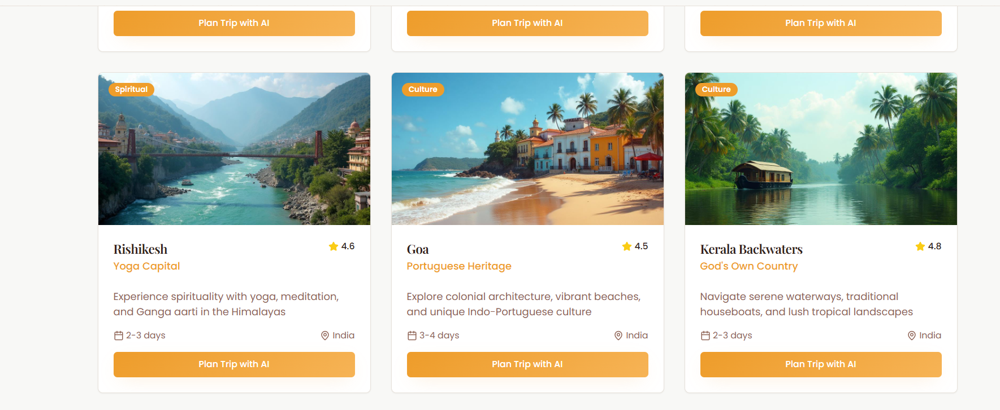
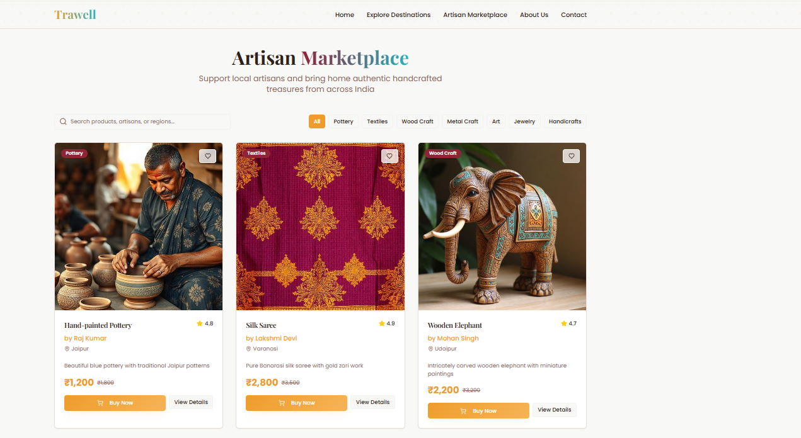
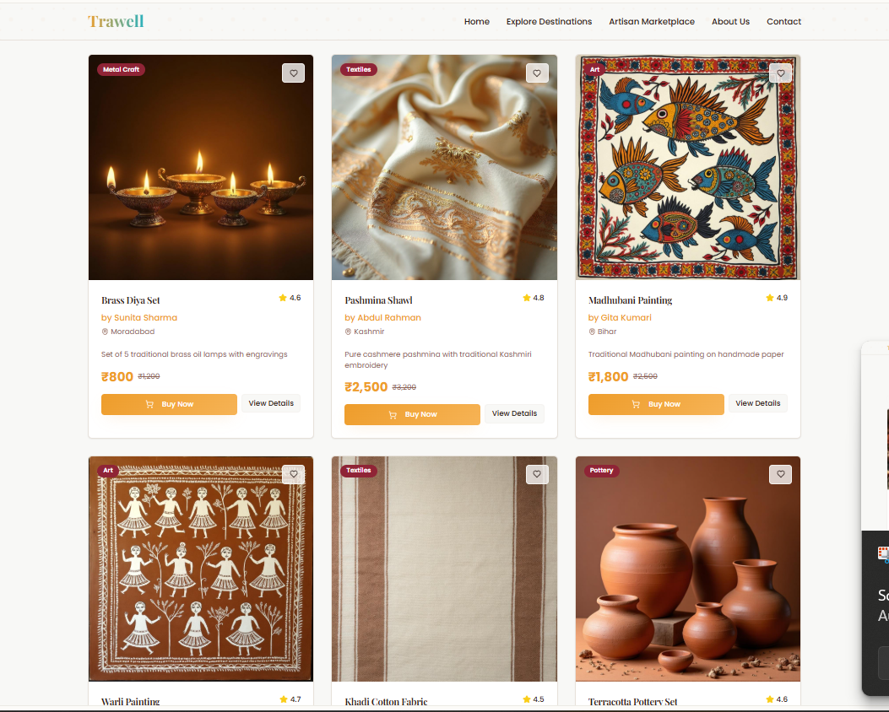
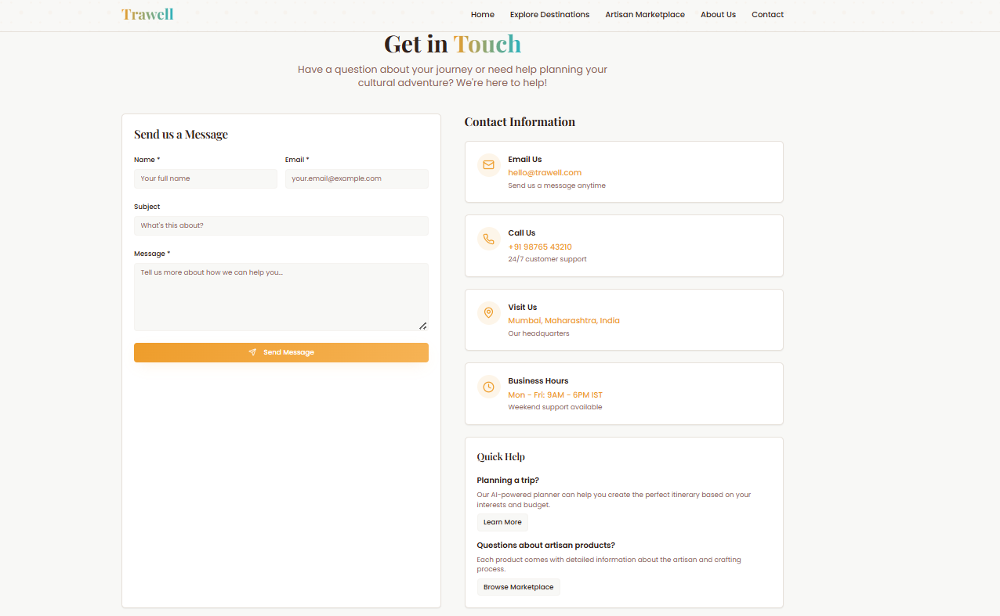

# 🧭 Trawell – Culture & Tourism Discovery Platform

**Trawell** is a web-based tourism and cultural discovery platform designed to connect **travelers with local artisans, handicrafts, and cultural destinations**.  
The platform promotes **sustainable tourism** by enabling users to explore authentic travel experiences while supporting local craftsmanship.

The application is built using **React, TypeScript, Vite, and Tailwind CSS**, providing a modern, responsive, and user-friendly interface for discovering destinations and cultural products.

---

## 📸 Screenshots

### Home Page


### Cultural Destinations



### Artisan Marketplace



### Contact Page


---

## 🚀 Features

- **Destination Discovery**
  - Users can explore various cultural destinations and tourist attractions.

- **Artisan Marketplace**
  - Showcases local handicrafts and artisan products with images and descriptions.

- **Responsive Design**
  - Works smoothly on both desktop and mobile devices.

- **Modern UI Components**
  - Built using reusable React components for consistent design.

- **Interactive Navigation**
  - Easy navigation between sections like **Home, Destinations, Marketplace, and Contact**.

- **Cultural Promotion**
  - Encourages awareness and appreciation of traditional crafts and cultural tourism.

---

## ⚙️ Requirements

Ensure the following software is installed before running the project:

- **Node.js** (v16 or above)
- **npm (Node Package Manager)**
- Modern web browser (Chrome, Edge, Firefox)

---

## 🛠️ Technology Stack

### Frontend
- React.js
- TypeScript
- Vite
- Tailwind CSS

### Development Tools
- Git
- GitHub
- ESLint
- PostCSS

---

## 🚀 Getting Started

### 1️⃣ Clone the Repository

```bash
git clone https://github.com/Manaswini-2512/trawell.git
cd trawell
